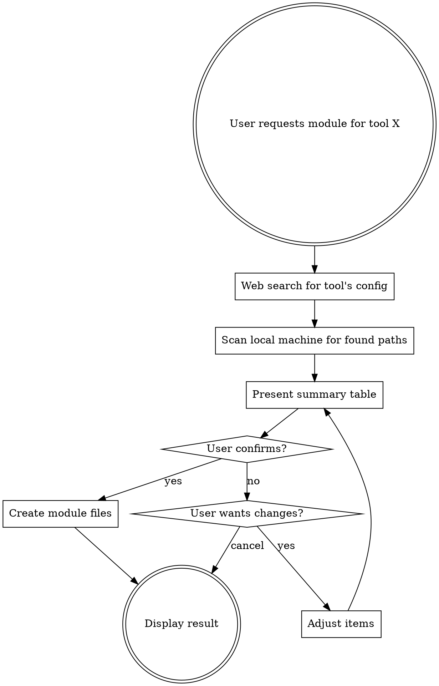

# Create Dotular Registry Module

Create a complete dotular registry module for a tool by researching its config files, scanning the local machine, and writing the module YAML.

## Critical Rule

1. **NEVER use `dotular add`**. That command writes to the user's personal `dotular.yaml` and only sets the destination for the current platform. This skill creates **registry modules** — standalone YAML files in `modules/` with cross-platform destinations. Always create files manually as described in Step 4.

2. **NEVER copy personal config files into registry modules**. Registry modules are shared/generic — they define package items and file destination mappings only. The `file:` items tell dotular *where* a config file belongs, but the actual config content comes from the user's own store, not the registry module. Do NOT create a `modules/<tool>/` subdirectory or copy files like `~/.config/tool/config.toml` into it.

## Process



## Step 1: Research (MANDATORY — do not skip)

You MUST use WebSearch to find the following for the tool across **all three platforms** (macOS, Linux, Windows). Do NOT rely on your training data alone — tools change their config locations across versions.

Search for:
- **Package manager names**: brew/brew-cask, apt, dnf, pacman, choco, winget, scoop, snap, flatpak
- **Config file and directory locations** per OS (check the tool's official docs)
- **macOS defaults domains** (for `setting` items) if the tool writes to `defaults`
- **Post-install setup commands** (for `run` items)
- **Verification command** (usually `tool --version`)
- **Install scripts** (for `script` items, e.g., curl-pipe-bash installers)

## Step 2: Local Scan

For each config path found in research, check if it exists on the user's machine:

```bash
# Expand ~ and check existence
ls -la ~/.config/toolname/ 2>/dev/null
ls -la ~/Library/Application\ Support/ToolName/ 2>/dev/null
```

Record which files/directories exist. This validates your research and confirms the correct destination paths for the `file:` items in the module YAML. Do NOT copy these files — the scan is only to verify paths.

## Step 3: Present Summary

Show a structured summary using this format:

```
## Proposed module: <tool-name>

### Packages
| Platform | Package | Via | skip_if |
|----------|---------|-----|---------|
| macOS | tool | brew | command -v tool |
| Linux | tool | apt | command -v tool |
| Windows | tool | winget | |

### Config Files & Directories
| Type | Name | Exists? | macOS | Linux | Windows |
|------|------|---------|-------|-------|---------|
| file | config.yml | Yes | ~/.config/tool | ~/.config/tool | %APPDATA%\tool |
| directory | themes | No | ~/.config/tool/themes | ~/.config/tool/themes | %APPDATA%\tool\themes |

### Settings (if any)
| Domain | Key | Value |
|--------|-----|-------|
| com.example.tool | ShowSidebar | true |

### Post-install Commands (if any)
| Command | After |
|---------|-------|
| tool setup | package |

### Recommendation
Include: [items to include and why]
Skip: [items to skip and why]
```

Include a clear recommendation. Wait for user confirmation before proceeding.

## Step 4: Execute

After user confirms, **write the module YAML** at `modules/<tool>.yaml`:

```yaml
name: <tool-name>
version: "1.0.0"
items:
  - package: <name>
    via: brew
    skip_if: command -v <name>
    verify: <name> --version

  - package: <name>
    via: apt
    skip_if: command -v <name>

  - package: <name-or-id>
    via: winget

  - file: <filename>
    destination:
      macos: <path>
      linux: <path>
      windows: <path>
```

**Multiple package items**: Create a separate `package` item for each platform's package manager (see `dotular.yaml` VS Code module for this pattern). Use `skip_if: command -v <tool>` so only the available manager runs. The runner executes all items — an unavailable package manager simply fails, but `skip_if` prevents redundant installs after the first succeeds.

**File items**: The `file:` and `directory:` items define destination mappings only — where config files belong on each platform. Do NOT create a `modules/<tool>/` subdirectory or copy personal config files into it. The user's own dotular store provides the actual file content at apply time.

## Step 5: Verify

Display the complete contents of the generated `modules/<tool>.yaml` for user review.

## YAML Field Reference

| Field | When to use | Notes |
|-------|-------------|-------|
| `skip_if` | Package and script items | `command -v <tool>` for idempotency |
| `verify` | Package and binary items | Usually `tool --version` |
| `direction` | Omit unless pull/sync needed | Defaults to `push` |
| `link` | When symlink management preferred | Set `true`; omit for copy (default) |
| `permissions` | Sensitive files (credentials, tokens) | Use `"0600"` |
| `after` | Run items that depend on package install | Set to `package` |
| `via` | Required for package/script items | See package managers list below |

### Package managers by platform

| Platform | Managers |
|----------|----------|
| macOS | `brew`, `brew-cask`, `mas` |
| Linux | `apt`, `dnf`, `pacman`, `snap`, `flatpak`, `nix` |
| Windows | `winget`, `choco`, `scoop` |
| Cross-platform | `flatpak`, `nix` |

## Common Mistakes

| Mistake | Fix |
|---------|-----|
| Relying on training data for config paths | ALWAYS web search — paths change between versions |
| Missing `skip_if` on package items | Add `skip_if: command -v <tool>` for idempotency |
| Using trailing `/` in destination | Match existing convention: `~/.config/tool` not `~/.config/tool/` |
| Forgetting Windows paths | Always research all 3 platforms for PlatformMap |
| Using `dotular add` command | NEVER — it writes to personal `dotular.yaml` with single-platform destinations. Manually create `modules/<tool>.yaml` instead |
| Copying personal config files into module | NEVER — registry modules define destination mappings only, not file content. Do not create `modules/<tool>/` subdirectories or `cp` user configs into them |
| Editing user's `dotular.yaml` | This skill creates REGISTRY modules only — never touch personal config |
| Updating `modules/index.yaml` | Out of scope — tell user to add the entry manually |

## Out of Scope

- Editing the user's personal `dotular.yaml`
- Updating `modules/index.yaml` (remind user to do this manually)
- Encryption (`encrypted` field) or hooks
- Parameters/templating
